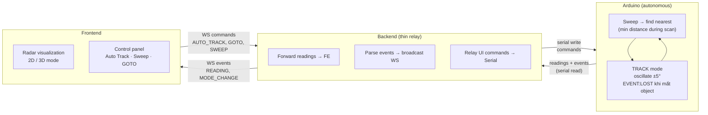
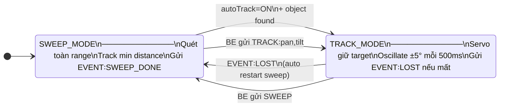
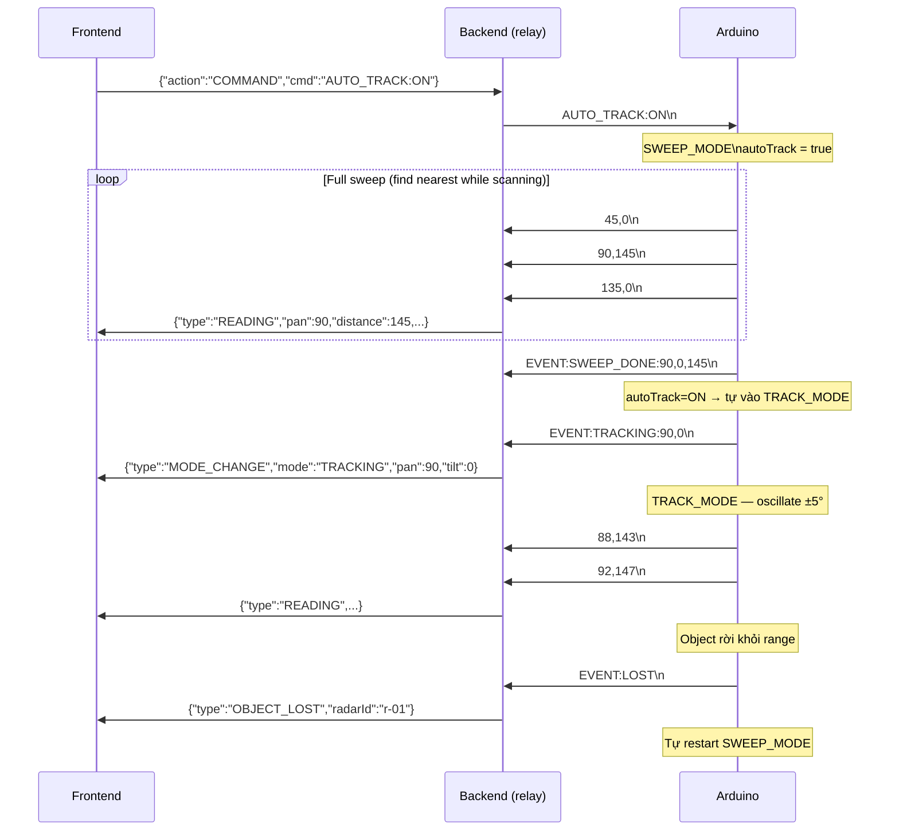
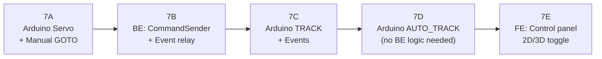
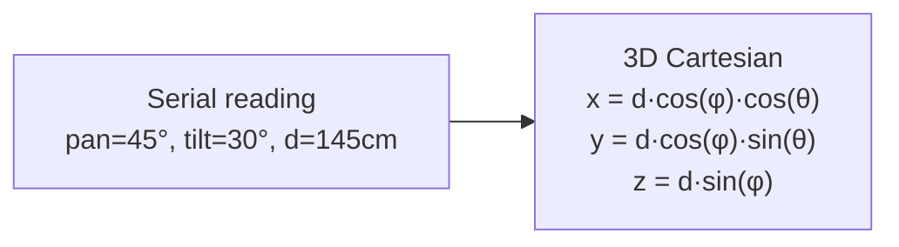
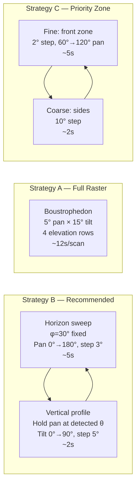
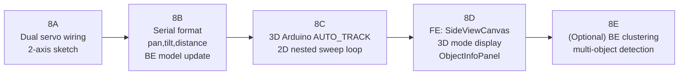

# Radar Tracking — Design & Implementation Plan

Bidirectional serial control: BE gửi lệnh xuống Arduino để điều hướng servo.  
**Tracking algorithm chạy trên Arduino** — BE chỉ là thin relay giữa Arduino và Frontend.

---

## Architecture



> Serial UART là full-duplex — đọc và ghi đồng thời trên cùng 1 port (jSerialComm hỗ trợ).

---

## Tracking Architecture Decision

### Arduino-side tracking (chosen)

Arduino tự tìm nearest object trong quá trình sweep và tự lock. BE không cần xử lý.

| Tiêu chí | Arduino-side ✅ | BE-side ❌ |
|---|---|---|
| Latency servo lock | **~0ms** (local) | ~375ms (serial round-trip) |
| Đổi thuật toán | Phải reflash | Deploy BE |
| Multi-object clustering | Khó (2KB SRAM) | Dễ |
| Complexity BE | **Thấp (relay only)** | Cao (TrackingService) |
| SRAM usage | ~430B (15° step scan) | N/A |

**Multi-object nâng cao**: BE vẫn nhận đủ readings → có thể cluster ở BE layer sau này mà không cần Arduino biết.

### Nearest-object algorithm trên Arduino

```cpp
// O(1) memory — chỉ track min distance trong sweep
int nearestDist = MAX_DISTANCE;
int nearestPan  = 90;
int nearestTilt = 0;

// Trong sweep loop:
if (d > 0 && d < nearestDist) {
    nearestDist = d; nearestPan = pan; nearestTilt = tilt;
}

// Sau khi sweep xong:
Serial.print("EVENT:SWEEP_DONE:"); Serial.print(nearestPan);
Serial.print(","); Serial.print(nearestTilt);
Serial.print(","); Serial.println(nearestDist);

if (autoTrack && nearestDist < MAX_DISTANCE) {
    startTracking(nearestPan, nearestTilt);   // tự lock, không cần BE
}
```

---

## Serial Protocol

### Arduino → BE

| Message | Ý nghĩa |
|---------|---------|
| `90,145\n` | Reading — 1 servo: `angle,distance` |
| `45,30,145\n` | Reading — 2 servo: `pan,tilt,distance` |
| `EVENT:SWEEP_DONE:pan,tilt,dist\n` | Sweep xong, kèm nearest object info |
| `EVENT:TRACKING:pan,tilt\n` | Xác nhận servo đã lock |
| `EVENT:LOST\n` | Object đang track biến mất |

### BE → Arduino

| Command | Ý nghĩa |
|---------|---------|
| `SWEEP\n` | Bắt đầu sweep từ đầu |
| `GOTO:pan\n` / `GOTO:pan,tilt\n` | Di chuyển servo tới góc (1 lần) |
| `TRACK:pan\n` / `TRACK:pan,tilt\n` | BE override: lock góc cụ thể |
| `AUTO_TRACK:ON\n` | Arduino tự track nearest sau mỗi sweep |
| `AUTO_TRACK:OFF\n` | Chỉ sweep và report, không tự lock |
| `CONFIG:STEP:deg\n` | Bước quét (default 2°) |
| `CONFIG:SPEED:ms\n` | Delay giữa các bước (default 15ms) |

---

## Arduino State Machine



### Tracking oscillation

Trong TRACK mode, servo không đứng yên hoàn toàn:
```
mỗi 500ms:
  quét target±5° (pan) và target±5° (tilt nếu có)
  nếu detect distance < threshold → object còn đó, gửi reading
  nếu 3 lần liên tiếp không thấy → gửi EVENT:LOST → về SWEEP_MODE
```

### Latency comparison

```mermaid
gantt
    title Servo lock-on latency
    dateFormat X
    axisFormat %Lms

    section Arduino-side (chosen)
    Sweep + detect nearest    : 0, 360
    Servo moves to target     : 360, 380

    section BE-side (rejected)
    Servo sweep 180°          : 0, 360
    Serial round-trip         : 360, 370
    BE processing + cmd       : 370, 375
    Servo moves to target     : 375, 395
```



---

## End-to-End Sequence (Arduino-side tracking)



---

## Backend Changes

BE **không cần** `TrackingService` phức tạp. Chỉ cần relay:

### Thêm `SerialCommandSender.kt`

```
com/nhan/radar/
└── control/
    └── SerialCommandSender.kt
```

- Nhận `SerialPort` reference từ `SerialIngestService`
- Methods: `send(cmd)`, `sweep()`, `autoTrack(on)`, `goto(pan, tilt?)`, `track(pan, tilt?)`
- Thread-safe write (`@Synchronized`)
- Log: `[SERIAL → Arduino] AUTO_TRACK:ON`

### Sửa `SerialIngestService.kt`

`parseLine()` handle EVENT prefix:
```kotlin
fun parseLine(line: String) {
    when {
        line.startsWith("EVENT:") -> handleEvent(line.removePrefix("EVENT:"))
        READING_RE.matches(line)  -> handleReading(line)
    }
}

fun handleEvent(event: String) {
    when {
        event.startsWith("SWEEP_DONE:") -> {
            // Parse nearest info, broadcast MODE_CHANGE
        }
        event.startsWith("TRACKING:")   -> { /* broadcast TRACKING confirmed */ }
        event == "LOST"                 -> { /* broadcast OBJECT_LOST */ }
    }
}
```

### Sửa `RadarWebSocket.kt`

WS actions từ FE:
```
SUBSCRIBE / UNSUBSCRIBE      (hiện tại)
COMMAND:SWEEP                (mới)
COMMAND:GOTO:pan[,tilt]      (mới)
COMMAND:TRACK:pan[,tilt]     (mới — BE override)
COMMAND:AUTO_TRACK:ON        (mới)
COMMAND:AUTO_TRACK:OFF       (mới)
```

---

## Arduino Code Changes

### Pin setup (2 servo)
```cpp
#include <Servo.h>
#define PAN_PIN   6
#define TILT_PIN  9    // bỏ qua nếu 1 servo

Servo panServo;
Servo tiltServo;
```

### State + tracking vars
```cpp
enum Mode { SWEEP, TRACK, GOTO_ONCE };
Mode currentMode = SWEEP;

bool autoTrack    = false;
int  panStep      = 5;    // độ/bước sweep
int  tiltStep     = 15;   // chỉ dùng khi có tilt servo
int  sweepDelay   = 15;   // ms giữa các bước

// Nearest tracking (O(1) memory)
int nearestDist  = MAX_DISTANCE;
int nearestPan   = 90;
int nearestTilt  = 0;

int targetPan    = 90;
int targetTilt   = 0;
int lostCount    = 0;
```

### `checkCommands()` (gọi đầu `loop()`)
```cpp
void checkCommands() {
    if (!Serial.available()) return;
    String cmd = Serial.readStringUntil('\n');
    cmd.trim();

    if (cmd == "SWEEP")               { currentMode = SWEEP; resetNearest(); }
    else if (cmd == "AUTO_TRACK:ON")  { autoTrack = true; }
    else if (cmd == "AUTO_TRACK:OFF") { autoTrack = false; }
    else if (cmd.startsWith("GOTO:")) { parseAndGoto(cmd.substring(5)); }
    else if (cmd.startsWith("TRACK:")) { parseAndTrack(cmd.substring(6)); }
    else if (cmd.startsWith("CONFIG:STEP:"))  { panStep   = cmd.substring(12).toInt(); }
    else if (cmd.startsWith("CONFIG:SPEED:")) { sweepDelay = cmd.substring(13).toInt(); }
}
```

### `doSweep()` — track nearest inline
```cpp
void doSweep() {
    resetNearest();
    for (int pan = 0; pan <= 180; pan += panStep) {
        checkCommands();   // non-blocking check mid-sweep
        moveServos(pan, 0);
        delay(sweepDelay);
        int d = readDistance();
        sendReading(pan, 0, d);
        if (d > 0 && d < nearestDist) {
            nearestDist = d; nearestPan = pan;
        }
    }
    // Báo cáo nearest
    Serial.print("EVENT:SWEEP_DONE:"); Serial.print(nearestPan);
    Serial.print(",0,"); Serial.println(nearestDist);

    if (autoTrack && nearestDist < MAX_DISTANCE) {
        startTracking(nearestPan, 0);
    }
}
```

### `loop()`
```cpp
void loop() {
    checkCommands();
    switch (currentMode) {
        case SWEEP:     doSweep();    break;
        case TRACK:     doTrack();    break;
        case GOTO_ONCE: doGoto();     break;
    }
}
```

---

## Frontend Changes

### WS message types

```typescript
// Existing
{ type: 'READING',      radarId, angle, distance, timestamp }

// New
{ type: 'READING',      radarId, pan, tilt, distance, timestamp }  // 2-servo
{ type: 'MODE_CHANGE',  radarId, mode: 'SWEEPING'|'TRACKING'|'IDLE', pan?, tilt? }
{ type: 'OBJECT_LOST',  radarId }
```

### Display Mode Toggle (2D / 3D)

```typescript
type DisplayMode = '2D' | '3D'
const [displayMode, setDisplayMode] = useState<DisplayMode>('2D')
```

**2D mode** — layout hiện tại, single radar canvas:
```
[Dropdown: 2D ▾]  [◎ TRACKING 90°]  [Auto Track: ON]  [Sweep Now]

┌──────────────────────────────────┐
│         Radar (top-down)         │
│          Pan × Distance          │
│                                  │
│              ●                   │
└──────────────────────────────────┘
```

**3D mode** — two canvases + object info:
```
[Dropdown: 3D ▾]  [◎ TRACKING 90°/30°]  [Auto Track: ON]  [Sweep Now]

┌──────────────────┐  ┌──────────────────┐
│   Top-down View  │  │   Side View      │
│   Pan × Distance │  │  Tilt × Distance │
│       ●          │  │      ●           │
└──────────────────┘  └──────────────────┘

┌──────────────────────────────────────────────┐
│  Object #1 │ x: 1.2m  y: 0.8m  z: 0.3m      │
│  dist: 1.47m │ status: TRACKING               │
└──────────────────────────────────────────────┘
```

Cả hai mode cùng nhận data từ 1 WS hook — chỉ khác layout render. Không mất data khi switch.

### Component changes

| Component | Thay đổi |
|---|---|
| `App.tsx` | Thêm `displayMode` state + dropdown |
| `RadarCanvas` | Dùng `pan` thay `angle` (backward-compat nếu cần) |
| `SideViewCanvas` (mới, 3D only) | Canvas tilt × distance |
| `ObjectInfoPanel` (mới, 3D only) | Coords, status, velocity |
| `useRadarWebSocket` | Handle `MODE_CHANGE`, `OBJECT_LOST` |

---

## Implementation Phases Overview



## Implementation Phases

### Phase 7A — Arduino Servo + Manual GOTO
- [ ] `<Servo.h>`, wiring (pan D6, tilt D9)
- [ ] SWEEP mode với servo movement + `sendReading()`
- [ ] `checkCommands()` + GOTO command
- [ ] Test: BE gửi `GOTO:45\n` → servo di chuyển

### Phase 7B — BE Command Sender + Event Relay
- [ ] `SerialCommandSender.kt` (thread-safe write)
- [ ] Expose `SerialPort` từ `SerialIngestService`
- [ ] `parseLine()` handle `EVENT:` prefix
- [ ] WS action `COMMAND:GOTO:angle` → FE điều khiển được servo

### Phase 7C — Arduino TRACK mode + Events
- [ ] TRACK mode với oscillation ±5°
- [ ] `EVENT:SWEEP_DONE:pan,tilt,dist` sau mỗi sweep
- [ ] `EVENT:LOST` sau 3 miss liên tiếp → tự SWEEP lại
- [ ] `EVENT:TRACKING:pan,tilt` confirm lock

### Phase 7D — Arduino AUTO_TRACK (thin BE)
- [ ] `autoTrack` flag trên Arduino
- [ ] `doSweep()` track nearest inline (không cần TrackingService BE)
- [ ] WS action `COMMAND:AUTO_TRACK:ON/OFF`
- [ ] BE chỉ relay, broadcast `MODE_CHANGE` / `OBJECT_LOST`
- [ ] Test: object xuất hiện → servo tự lock **ngay** (0ms latency)

### Phase 7E — Frontend Tracking UI
- [ ] Display mode dropdown (`2D` / `3D`)
- [ ] Mode badge + sweep/track status
- [ ] Tracked object highlight (đỏ vs xanh)
- [ ] Auto Track toggle + Sweep Now button
- [ ] Canvas click → `COMMAND:GOTO:angle`
- [ ] `OBJECT_LOST` flash indicator
- [ ] (3D mode) SideViewCanvas + ObjectInfoPanel

---

## Open Questions

1. **Servo speed**: Standard servo 0.12s/60° đủ nhanh? Nếu object di chuyển nhanh cần digital servo (~0.05s/60°).
2. **Sweep range**: 0→180° hay configurable từ FE?
3. **Multi-object BE clustering**: Khi nào cần? BE đã có đủ readings để làm sau.
4. **Concurrency jSerialComm**: `outputStream` concurrent với `inputStream` read thread — cần verify thực tế.

---

## 3D Extension: Dual-Servo + 3D Space

> Kịch bản khi có 2 servo (pan + tilt) — tất cả design ở trên vẫn áp dụng, chỉ thêm tilt dimension.

### Coordinate System



| Servo | Trục | Range |
|---|---|---|
| Pan (Servo 1, D6) | Azimuth θ — trái/phải | 0° → 180° |
| Tilt (Servo 2, D9) | Elevation φ — lên/xuống | 0° → 90° |

Serial format: `pan,tilt,distance\n`

### 3D Scan Strategies



### 3D Arduino AUTO_TRACK

Exact same approach — `doSweep()` loops over (pan, tilt), tracks nearest:
```cpp
for (int tilt = 0; tilt <= 90; tilt += tiltStep) {
    for (int pan = 0; pan <= 180; pan += panStep) {
        // ... same nearest tracking logic
    }
}
// SWEEP_DONE includes nearest pan + tilt
```

### Data Model (3D)

```kotlin
// Backend
data class RadarReading(
    val radarId: String,
    val pan: Int,       // azimuth 0-180°
    val tilt: Int,      // elevation 0-90° (0 khi 1 servo)
    val distance: Int,  // cm
    val timestamp: Long
)
```

```typescript
// Frontend
interface RadarReading {
  type: 'READING'
  radarId: string
  pan: number      // azimuth degrees
  tilt: number     // elevation degrees (0 for 1-servo)
  distance: number // cm
  timestamp: number
}
```

### Phase Plan (3D Extension)



### Feasibility Summary

| Feature | Feasible | Limitation |
|---|---|---|
| Detect object position 3D | ✅ | ±5° góc, ±3cm distance |
| Track 1 object (Arduino-side) | ✅ | ~7–12s scan cycle |
| Multiple object tracking | ⚠️ | BE clustering, noisy HC-SR04 |
| Object velocity | ⚠️ | Rough, slow scan rate |
| Object size estimation | ⚠️ | Beam cone ~30% error |
| Real-time smooth tracking | ❌ | HC-SR04 tốc độ giới hạn |
